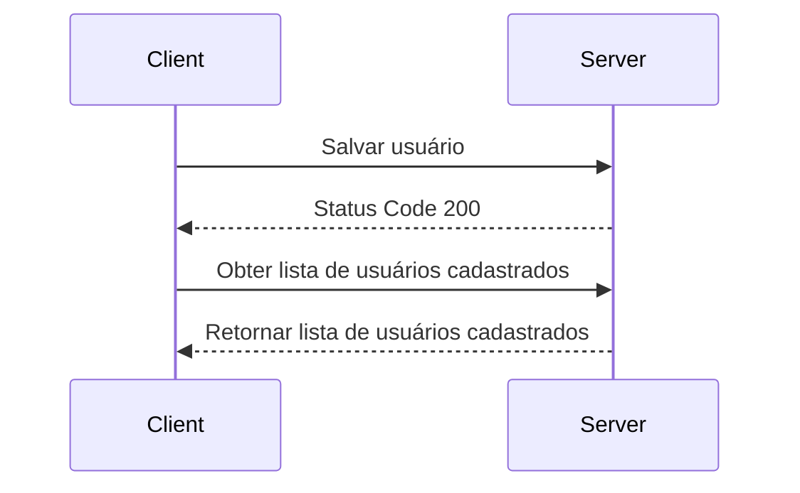

# Projeto Teste Vaga de Full Stack PHP

Olá candidato, tudo bom? Espero que sim!
Vamos lá, a idéia é que você gere um fork desse repositório e crie um projeto conforme o layout proposto na imagem abaixo, utilizando **exclusivamente** as tecnologias especificadas.

## Front End

- HTML5
- CSS
- JavaScript
- AngularJS 1.x
- Bootstrap 3.2
- FontAwesome 4.7

> Utilizar requisições XHR (Ajax) p/ os processos CRUD (Create, Retrieve, Update e Delete) entre Front-end e Back-end

## Back End

- PHP
- BD MySQL

## Diagrama

Abaixo segue uma representação básica do processo que a tela deve seguir:

## Regras

- Sobrenome, Telefone e Data de Nascimento não é obrigatório
- O e-mail é obrigatório, deve ser válido e não pode se repetir no cadastro de usuários
- Identificar p/ o usuário de forma clara quais campos são obrigatórios
- Estado, Cidade e Sexo são obrigatórios
- Permitir que um cadastro existente possa ser editado e atualizado
- Permitir que um cadastro existente possa ser excluído
